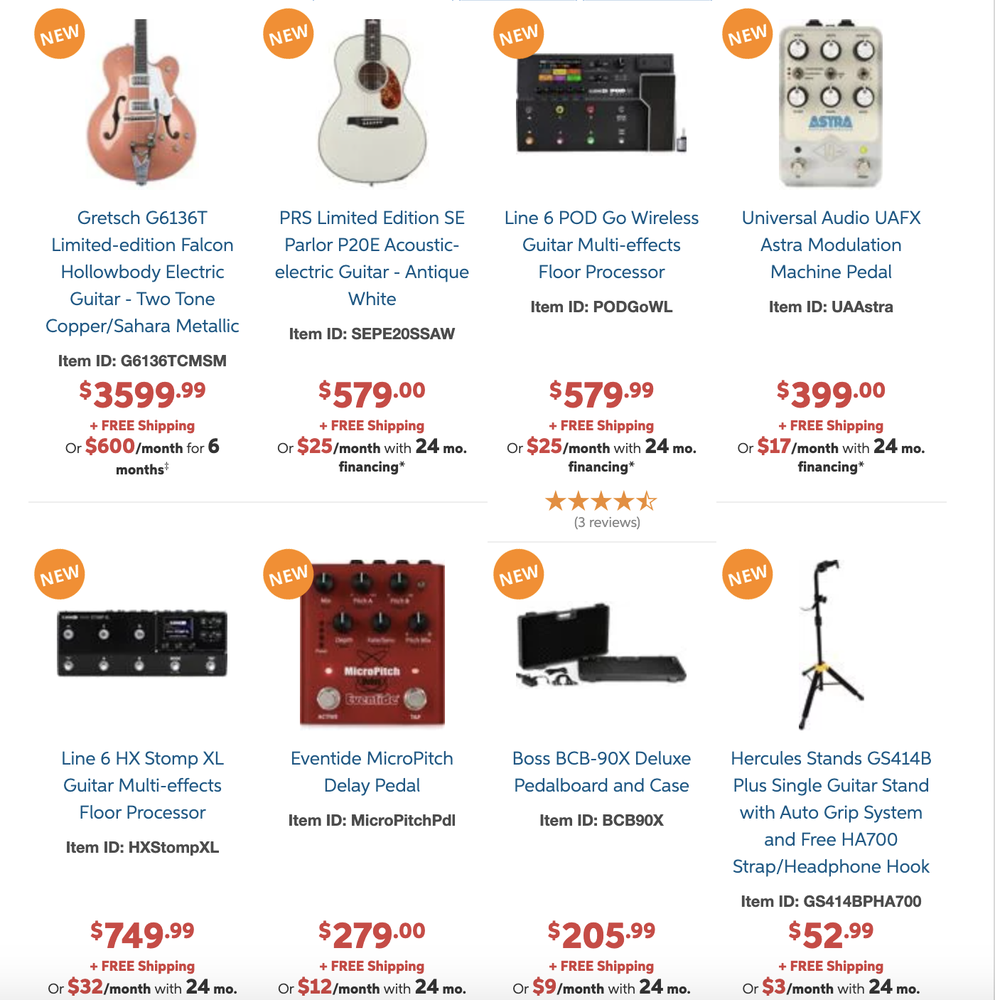
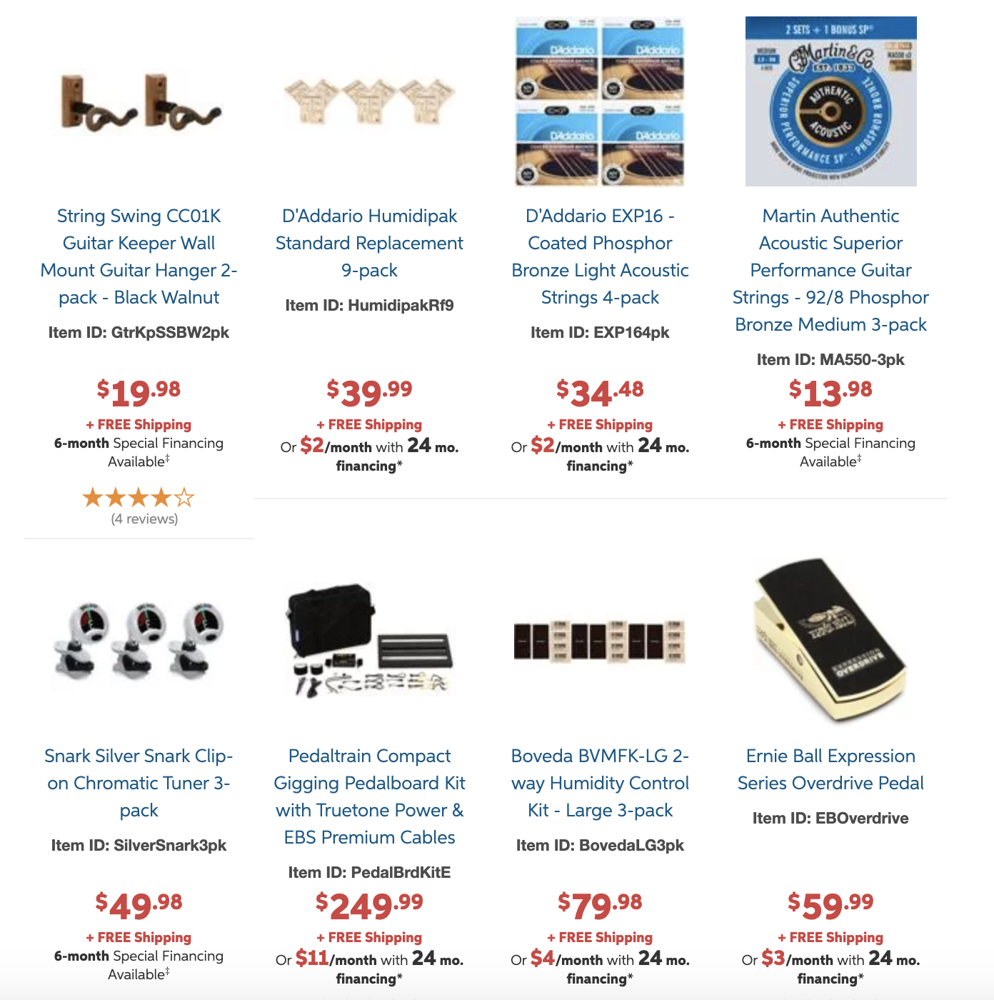
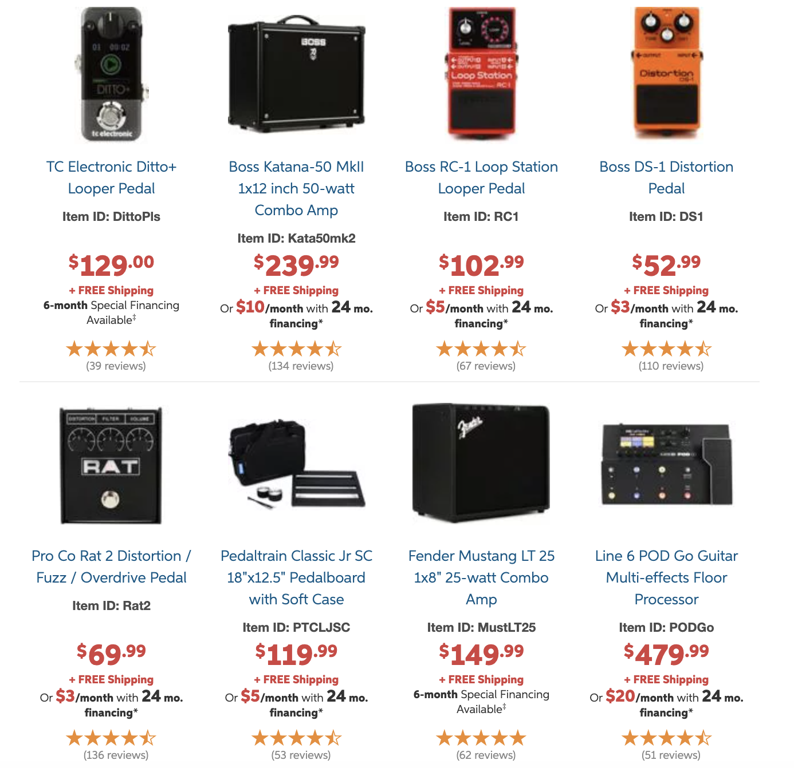

```{r setup, include=FALSE}

# Init
knitr::opts_chunk$set(warning = FALSE, message = FALSE)
knitr::opts_chunk$set(echo = TRUE)
options(dplyr.summarise.inform = FALSE)
library(tidyverse)
library(kableExtra)

```

## Assignment 11 - Recommender Systems {.tabset}

### Overview

Sweetwater.com is a site that caters to musicians, producers, performers, and studio engineers, offering a huge catalogue of music-related products for both production and performance. My approach to this assignment was as follows:

1. Perform a scenario design analysis.
2. Discern how the recommender system works as best as can be done. For this step, I did the following:
    a. Collect a list of products recommended to me as an existing customer with a significant order history.
    b. Create a new account and collect a list of products recommended to a new customer with no order history.
    c. Categorize each product as one of the following, based on its primary use: guitar, drum, keyboard, studio.
    d. Compare my order history with the recommended products from each list and see how each one fared.
3. Suggest improvements based on the above findings.

### Scenario Design Analysis

1. The target audience for the site is (obviously) the aforementioned individuals: musicians, producers, performers, and studio engineers. It carries equipment for primarily guitar-based music (guitar, bass, drums, keyboards, vocals), rather than woodwinds, brass, or orchestra equipment.
2. The key goal of these people is usually to drink heavily. So maybe they should think about selling beer along with their effects pedals. A second key goal is to look and sound cool, which requires expensive equipment. This is where Sweetwater comes in: They do the "expensive" part of that very well. Well, in all fairness, they do have good deals and are normally right around where Amazon is. And their customer service is excellent. I'm on a first-name basis with my rep.
3. Sweetwater helps their customers accomplish their dreams of rockstardom by making all of their gear sound like it will do everything you ever wanted without requiring any musical talent to actually use it. That's not entirely accurate, but some of the product descriptions have that bent. The truth is, musicians love music gear, so it honestly isn't too hard to sell us anything. I'll bet a first-grader could write the product descriptions and they'd still sell as well. For example, "I LIK THISS GITRE IT IS KOOL U SHOOD BY IT FOR 1 MILION DOLLERS." I mean, who could resist that kind of persuasion?

### Sweetwater's Recommendations

Sweetwater's page includes three tabs of recommended products:

* **New arrivals**    {width=25%} \
\
* **Top deals**       {width=25%}  \
\
* **What's hot**      {width=25%}    \

### Data Collection

This code reads in some text files that I scraped from my purchase history and from the sweetwater.com web site, both for my own account (with an order history) and for a fresh account I just created.

```{r data_collection}

# Read tsv of purchases
purch <- read.delim("sweetwater_purchases.txt", header = F)
purch <- purch %>% rename(item = V1, category = V5) %>%
  select(item, category)

# Create data frame for customer recommendations
recommend <- data.frame(matrix(vector(), 0, 4), stringsAsFactors=F)

# Read tsv's of existing customer recommended items.
# Items will be in six files:
# 1. Existing customer - new arrivals
# 2. Existing customer - top deals
# 3. Existing customer - what's hot
# 4. New customer - new arrivals
# 5. New customer - top deals
# 6. New customer - what's hot
recommend <- read.delim("sweetwater_existing_newarr.txt", header = F)
recommend <- recommend %>%
  rename(item = V1, category = V2) %>%
  mutate(page = "new arrivals", customer = "existing")
tmp <- read.delim("sweetwater_existing_deals.txt", header = F)
tmp <- tmp %>%
  rename(item = V1, category = V2) %>%
  mutate(page = "top deals", customer = "existing")
recommend <- bind_rows(recommend, tmp)
tmp <- read.delim("sweetwater_existing_hot.txt", header = F)
tmp <- tmp %>%
  rename(item = V1, category = V2) %>%
  mutate(page = "what's hot", customer = "existing")
recommend <- bind_rows(recommend, tmp)
tmp <- read.delim("sweetwater_new_newarr.txt", header = F)
tmp <- tmp %>%
  rename(item = V1, category = V2) %>%
  mutate(page = "new arrivals", customer = "new")
recommend <- bind_rows(recommend, tmp)
tmp <- read.delim("sweetwater_new_deals.txt", header = F)
tmp <- tmp %>%
  rename(item = V1, category = V2) %>%
  mutate(page = "top deals", customer = "new")
recommend <- bind_rows(recommend, tmp)
tmp <- read.delim("sweetwater_new_hot.txt", header = F)
tmp <- tmp %>%
  rename(item = V1, category = V2) %>%
  mutate(page = "what's hot", customer = "new")
recommend <- bind_rows(recommend, tmp)
recommend <- recommend %>%
  arrange(customer, page, category, item)

# Display tables
kable(purch, caption = 
  "<i><font color=#000000><b>Table 1.</b> Purchase history.</font></i>") %>% 
  kable_styling(latex_options = "striped")
kable(recommend, caption = 
  "<i><font color=#000000><b>Table 1.</b> Recommended products.</font></i>") %>% 
  kable_styling(latex_options = "striped")

```

### Recommender System Analysis

```{r analysis}

# Purchase history summary
tmp_purch <- purch %>% group_by(category) %>%
  summarise(count = n()) %>%
  mutate(type = "purchased")

# Recommended products summary
tmp_existing <- recommend %>%
  filter(customer == "existing") %>%
  group_by(category) %>%
  summarize(count = n()) %>%
  mutate(type = "recommended")

# Merge together for plot
merged_existing <- tmp_purch %>%
  bind_rows(tmp_existing)

# Plot existing customer recommendations
merged_existing %>% ggplot() +
  geom_bar(aes(x = category, y = count, fill = type), stat = "identity", position = "dodge", width = 0.5) +
  ggtitle("Existing customer - recommended products vs. order history")

# Recommended products summary
tmp_new <- recommend %>%
  filter(customer == "new") %>%
  group_by(category) %>%
  summarize(count = n()) %>%
  mutate(type = "recommended")

# Merge together for plot
merged_new <- tmp_purch %>%
  bind_rows(tmp_new)

# Plot existing customer recommendations
merged_new %>% ggplot() +
  geom_bar(aes(x = category, y = count, fill = type), stat = "identity", position = "dodge", width = 0.5) +
  ggtitle("New customer - recommended products vs. order history")

```

Based on the above analysis, it doesn't appear that Sweetwater's recommender system is related to order history at all. A few alternate ideas came to mind.

* **Frequently bought together**

I spot-checked a few items I bought to see if any of those items were frequently bought together with any of the recommended items, but this also didn't prove to be the case.

* **Random?**

It doesn't appear to be random; otherwise a new customer would be equally likely to be recommended the same products as I was.

* **Inventory dump**

Because there was some overlap with new customers, my guess is that at least some of the recommendations were based on inventory they're trying to unload.

* **Similar cost**

I also thought it might be by amount spent, but the total I've spent on studio gear far outweighs anything in the other categories (I'm not including the amounts in the table, because I was mortified at how much I've blown on gear over the past few years).

* **Clustering/collaborative filtering**

My best guess is that they use some kind of poorly implemented clustering or collaborative filtering system, and I happen to be situated next to a customer who likes crappy gear (or I happen to have been assigned to the "crappy gear cluster"). Or maybe it's trying to give me a subtle hint that I like crappy gear.

* **Buggy code?**

The fact that they didn't recommend a single product from the drum, keyboard, or studio category--and that all recommended products were from the guitar category--tells me that maybe there is a glitch in their code that may require the attention of a data scientist.

Any way I looked at it, it wasn't obvious to me how they were recommending products -- other than "poorly."

### Recommendation

Because it was difficult to discern which recommender system they use, one recommendation would be to at least select a few products related to order history, possibly switching to a search-based system that uses item category from the customer's order history.

An additional recommendation would be to place recommendation on a single page, have fewer of them, and not require a user to scroll as much to view them. I think a user is typically pretty lazy when it comes to looking for things; if it doesn't jump out at him, I'd bet the chances he'd click on something drop exponentially.
