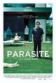

```{r setup, include=FALSE}
# Init
knitr::opts_chunk$set(echo = TRUE)
options(dplyr.summarise.inform = FALSE)
library(tidyverse)
library(RMySQL)
library(getPass)
library(knitr)
```

# OVERVIEW  
  
I asked 23 friends, coworkers, and family members to complete a SurveyMonkey survey that asked them to rate six recent popular movies.
  
&nbsp; | &nbsp; | &nbsp;
-------|--------|-------
 1. The Outpost |  2. The Invisible Man |  3. The Platform (El Hoyo)
 4. Mulan |  5. Parasite |  6. Uncut Gems

*Note: All images are from rottentomatoes.com.*

---------

# DATA  
  
```{r db_params, include=FALSE}
# Database connection parameters
hostname <- "192.168.0.100"
username = "root"
if (interactive()) {
  pwd <- getPass("Enter database password:")
} else {
  pwd = readChar('pwd_file.txt', file.info('pwd_file.txt')$size)
}
db = dbConnect(MySQL(), user=username, password=pwd, dbname='ippolito-films', host=hostname)
```
  
### Entity relationship diagram  
  
  
  
### Films and genres 
```{r films_and_genres, echo=FALSE}
# Get genres and films
rs = dbSendQuery(db, "select film_genres.film_fk, genres.genre 
from film_genres
inner join genres on genres.genre_id=film_genres.genre_fk;")
genres = fetch(rs, n=-1)
rs = dbSendQuery(db, "select films.film_id, films.film_title, 
group_concat(genres.genre order by genres.genre separator ', ') as genres
from films
inner join film_genres on film_genres.film_fk=films.film_id
inner join genres on genres.genre_id=film_genres.genre_fk
group by film_id;")
films = fetch(rs, n=-1)
kable(films)
```
### Ratings 
```{r ratings_table, echo=FALSE}
rs = dbSendQuery(db, "select * from ratings;")
ratings = fetch(rs, n=-1)
kable(ratings)
```
### Respondents 
```{r respondents_table, warning=FALSE, echo=FALSE}
rs = dbSendQuery(db, "select * from respondents;")
respondents = fetch(rs, n=-1)
kable(respondents[1:5, ])
```
### Survey responses 
```{r responses_table, echo=FALSE}
sql <- "select responses.response_id, responses.respondent_fk, responses.film_fk, films.film_title, 
responses.rating_fk, ratings.rating_text
from responses
inner join films on films.film_id=responses.film_fk
left outer join ratings on ratings.rating_id=responses.rating_fk
order by responses.response_id;"
rs = dbSendQuery(db, sql)
responses = fetch(rs, n=-1)
kable(responses[1:10, ])
```
  
---------
  
# SURVEY RESULTS  
  
As the evidence indicates, obviously I need to find some new friends. Many of my so-called friends and family didn't even see some of the best movies on the list.
  
```{r survey_results, warning=FALSE, echo=FALSE}
sql <- "select j.film_id, j.rating_id, films.film_title,
concat(ratings.rating_id, ' - ', ratings.rating_text) as rating, 
count(jj.response_id) as ct
from (
  select ratings.rating_id, films.film_id
  from ratings, films
) j
left outer join (
  select u.rating_fk, u.film_fk, u.response_id from (
    (select 0 as rating_fk, film_fk, response_id from responses where responses.rating_fk is null)
    union all
    (select rating_fk, film_fk, response_id from responses where not responses.rating_fk is null)
  ) u
) jj
on (jj.film_fk=j.film_id and jj.rating_fk=j.rating_id)
inner join ratings on ratings.rating_id=j.rating_id
inner join films on films.film_id=j.film_id
group by j.film_id, j.rating_id
order by film_id, rating_id;"
rs = dbSendQuery(db, sql)
results = fetch(rs, n=-1)
results %>% 
  ggplot(mapping = aes(x = film_title, y = ct, fill = rating)) + 
  geom_bar(position = "dodge", stat = "identity") +
  coord_flip() + xlab("Film") + ylab("Responses")
```
  
### *Parasite* is the Clear Winner  
  
Excluding results where respondents indicated they hadn't seen the film, the winner is obvious.  
  
```{r results2, echo=FALSE}
results %>% filter(rating_id != 0) %>%
  ggplot(mapping = aes(x = film_title, y = ct, fill = rating)) + 
  geom_bar(position = "dodge", stat = "identity") +
  coord_flip() + xlab("Film") + ylab("Responses")
```
  
### People Love Drama, a Good Laugh--and a Good Surprise  
#### (but only if it's not too scary)  
  
Broken out by genre, the survey respondents favoured films having elements of mystery, drama, and comedy. The biggest losers were the war, science fiction, and horror films.  
  
```{r results3, echo=FALSE}
results %>% filter(rating_id != 0) %>%
  merge(genres, by.x = "film_id", by.y = "film_fk") %>%
  ggplot(mapping = aes(x = genre, y = ct, fill = rating)) + 
  geom_bar(position = "dodge", stat = "identity") +
  coord_flip() + xlab("Genre") + ylab("Responses")
```
  
# FILM RECOMMENDATIONS
  
I generated a list of recommendations for each respondent based on which films they rated either a 4 or 5. If they didn't see any of the movies, or if they've already seen all the movies in the list for their favourite genres, I picked one for them but marked it with a disclaimer.
  
```{r recommendations, echo=FALSE}
# Choose favourite genres based on whether respondents ranked a film 4 or higher
faves <- responses %>% filter(rating_fk > 3 & !is.na(rating_fk)) %>%
  merge(genres, by = "film_fk") %>%
  select(respondent_fk, genre) %>% arrange(respondent_fk)

# Choose films they haven't seen
notseen <- responses %>% filter(is.na(rating_fk)) %>%
  merge(genres, by = "film_fk") %>%
  select(respondent_fk, film_title, genre) %>% arrange(respondent_fk)

# Merge favourites with not seen films
merged <- merge(faves, notseen, by = c("respondent_fk","genre")) %>% arrange(respondent_fk)

# Choose films that people haven't seen, if they've seen a film with the same genre and rated it 4 or 5 stars
recommend1 <- merge(respondents, merged, by.x = "respondent_id", by.y = "respondent_fk", all.x = TRUE) %>%
  select(respondent_id, film_title) %>%
  group_by(respondent_id) %>%
  summarize(film_title = last(film_title)) %>%
  mutate(disclaimer = "")

# Choose all the NAs and pick any film they haven't seen
recommend2 <- recommend1 %>% filter(is.na(film_title)) %>%
  merge(notseen, by.x = "respondent_id", by.y = "respondent_fk") %>%
  group_by(respondent_id) %>%
  summarize(film_title = last(film_title.y)) %>%
  mutate(disclaimer = "(You might be disappointed)")

# Merge the two lists
recommend1 <- recommend1 %>%
  filter(!is.na(film_title))
recommendations <- rbind(recommend1, recommend2) %>%
  arrange(respondent_id)
kable(recommendations)
```

  
# FURTHER INVESTIGATION  
  
### Can we correlate people's film preferences to any of the following?  
  
+ **Morning people vs night people**: (the time of day when they took the survey)
+ **Pantsers vs planners** (how long spent taking the survey)
+ **Procrastinators vs anticipators** (how long they waited before they took the survey)
  
```{r binning, include=FALSE}
# Bin films by mood
films <- mutate(films, mood = ifelse(grepl("comedy", genres, fixed = TRUE), "comedic", "dramatic"))

# Bin respondents by time of day
respondents <- mutate(respondents, time_of_day = ifelse(as.integer(substr(started_at, 12, 13)) < 8, "morning", 
  ifelse(as.integer(substr(started_at, 12, 13)) >= 22, "night", "daytime")))

# Bin respondents by time spent
time_bins = c(0, 60, 120, 999)
respondents <- mutate(respondents, time_spent_bin = cut(sec_taken, time_bins))

# Bin respondents by how long they waited to take the survey
delay_bins = c(0, 120, 600, 3000)
respondents <- mutate(respondents, min_delay_bin = cut(min_delay, delay_bins))

# Generate responses subset
responses_subset <- merge(respondents, responses, by.x = "respondent_id", by.y = "respondent_fk") %>%
  merge(films, by.x = "film_fk", by.y = "film_id") %>%
  filter(!is.na(rating_fk)) %>%
  select(respondent_id, time_of_day, time_spent_bin, mood, min_delay_bin, rating_fk) %>%
  arrange(respondent_id)
```
  
### MORNING PEOPLE VS NIGHT PEOPLE  
  
I would have expected night people to be less serious and, hence, to favour comedies. Instead, there doesn't seem to be much of a difference.  
  
```{r morning_vs_night, echo=FALSE}
responses_subset %>% filter(time_of_day != "day") %>%
  group_by(mood, time_of_day) %>%
  summarize(mean_rating = mean(rating_fk)) %>%
  ggplot(mapping = aes(x = time_of_day, y = mean_rating, fill = mood)) + 
  geom_bar(position = "dodge", stat = "identity") +
  xlab("Morning vs Night") + ylab("Avg Rating")
```
  
### PANTSERS VS PLANNERS  
  
I was surprised here again. My expectation was that "pantsers" would prefer comedies. But the distribution was fairly even.  
  
```{r time_spent, echo=FALSE}
responses_subset %>%
  group_by(mood, time_spent_bin) %>%
  summarize(mean_rating = mean(rating_fk)) %>%
  ggplot(mapping = aes(x = time_spent_bin, y = mean_rating, fill = mood)) + 
  geom_bar(position = "dodge", stat = "identity") + 
  xlab("Time Spent on Survey (seconds)") + ylab("Avg Rating")
```
  
### PROCRASTINATORS VS ANTICIPATORS 
  
Another disappointing conclusion: I thought procrastinators would like comedies more. Again, the spread looks pretty even to me.  
  
```{r procrastinators, echo=FALSE}
responses_subset %>%
  group_by(mood, min_delay_bin) %>%
  summarize(mean_rating = mean(rating_fk)) %>%
  ggplot(mapping = aes(x = min_delay_bin, y = mean_rating, fill = mood)) + 
  geom_bar(position = "dodge", stat = "identity") +
  xlab("Time Waited to Take Survey (minutes)") + ylab("Avg Rating")
```
  
### FOILED AGAIN!  
  
Creating a sort of wonky Briggs-Meyer classification system, I tried finding a correlation between genre and the combination of the above attributes. No such luck.  
  
```{r foiled_again, echo=FALSE}
rtmp <- respondents %>% 
  mutate(pantser_planner = ifelse(sec_taken > 120, "planner", "pantser"), 
  pro_anti = ifelse(min_delay > 600, "procrastinator", "anticipator")) %>% 
  mutate (friend_cat = paste(time_of_day, "person/", pro_anti, "/", pantser_planner))
rtmp <- merge(rtmp, responses, by.x = "respondent_id", by.y = "respondent_fk") %>%
  merge(films, by.x = "film_fk", by.y = "film_id") %>%
  filter(!is.na(rating_fk)) %>%
  select(respondent_id, friend_cat, mood, rating_fk) %>%
  arrange(respondent_id)
rtmp %>%
  group_by(mood, friend_cat) %>%
  summarize(mean_rating = mean(rating_fk)) %>%
  ggplot(mapping = aes(x = friend_cat, y = mean_rating, fill = mood)) + 
  geom_bar(position = "dodge", stat = "identity") + coord_flip() + 
  xlab("Friend Category") + ylab("Avg Rating")
```
  
### A LAST-DITCH EFFORT TO FIND SOME KIND OF MEANING IN ALL OF THIS
  
I wanted to find some correlation in my data to make it worth writing these ~250 lines of code. What I found is that I only know two people who share my taste in films. Depressingly, this confirms my earlier conjecture that I need to find new friends.
  
```{r last_ditch, echo=FALSE}
my_ratings <- data.frame(film_fk = c(1:6), my_rating_fk = c(2, 3, 5, 0, 4, 4))
rtmp <- responses %>% merge(my_ratings, "film_fk") %>%
  mutate (rating_fk = ifelse(is.na(rating_fk), 0, rating_fk)) %>%
  mutate (dev_sqr = (rating_fk - my_rating_fk) ** 2) %>% 
  group_by(respondent_fk) %>% 
  summarize(michael_deviation = sqrt(sum(dev_sqr) / n())) 
ggplot(rtmp) + geom_histogram(mapping = aes(x = michael_deviation), binwidth = 0.5) +
  xlab("Michael Deviation")
```
