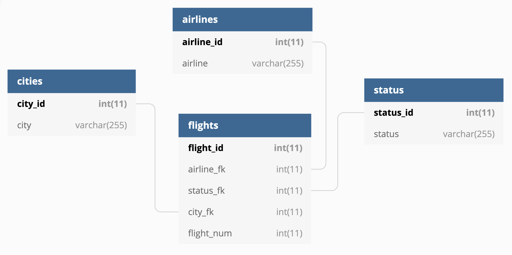

```{r setup, include=FALSE}
# Init
knitr::opts_chunk$set(echo = TRUE)
options(dplyr.summarise.inform = FALSE)
library(tidyverse)
library(knitr)
library(RCurl)
library(DiagrammeR)
library(kableExtra)
```

## Assignment 5 {.tabset}

### Overview\
\
In this assignment, the following tasks are performed:\
\
***Figure 1.** Overview flowchart*
\
```{r overview, echo=FALSE, fig.align="center"}

#Flowchart
grViz("digraph flowchart {
      # node definitions with substituted label text
      node [fontname = Helvetica, shape = rectangle]        
      tab1 [label = '@@1']
      tab2 [label = '@@2']
      tab3 [label = '@@3']
      tab4 [label = '@@4']
      tab5 [label = '@@5']
      tab6 [label = '@@6']
      tab7 [label = '@@7']

      # edge definitions with the node IDs
      tab1 -> tab2 -> tab3 -> tab4 -> tab5 -> tab6 -> tab7;
      }

      [1]: 'Import CSV from Github'
      [2]: 'Gather data into appropriate columns'
      [3]: 'Create child dataframes'
      [4]: 'Normalize data in flights dataframe'
      [5]: 'Clean up the data'
      [6]: 'Data analysis'
      [7]: 'Conclusion'
      
      labelloc = 't'
      label = 'test'
  ")
```

### Import\
\
Import csv file from Githup into an initial format.\
\
```{r get_csv_file}

# Download the flight info CSV from Github
csvfile <- getURL("https://raw.githubusercontent.com/mmippolito/cuny/main/data607/assignment5/flightinfo.csv")
rawdata <- read.csv(text = csvfile)
kable(rawdata, caption = "<i><font color=#000000><b>Table 1.</b> Raw flight data read from CSV</font></i>") %>% 
  kable_styling(latex_options = "striped")
```

### Gather\
\
Preliminary tidying:\
\
* Populate the missing airline names.\
* Gather the data keyed off city name.\
* Remove commas from flight counts.\
* Convert flight counts to numeric values.\
\
``` {r gather}
# Data will look like this:
#       Airline   Flight.Status Los.Angeles Phoenix San.Diego San.Francisco Seattle
# [1,] "ALASKA"  "on time"     "497"       "221"   "212"     "503"         "1,841"
# [2,] ""        "delayed"     " 62"       "12"    " 20"     "102"         "305"  
# [3,] "AM WEST" "on time"     "694"       "4,840" "383"     "320"         "201"  
# [4,] ""        "delayed"     "117"       "415"   " 65"     "129"         "61"   

# Populate missing values in Airline column
rawdata[[1]][2] <- "ALASKA"
rawdata[[1]][4] <- "AM WEST"

# Gather into this format:
#       Airline   Flight.Status city            num_flights
#  [1,] "ALASKA"  "on time"     "Los.Angeles"   "497"    
#  [2,] "ALASKA"  "delayed"     "Los.Angeles"   "62"    
#  [3,] "AM WEST" "on time"     "Los.Angeles"   "694"    
#  [4,] "AM WEST" "delayed"     "Los.Angeles"   "117"    
flights <- gather(rawdata, "Los.Angeles", "Phoenix", "San.Diego", "San.Francisco", "Seattle", 
                  key = "city", value="num_flights")

# Remove commas from flight counts and convert to numeric
flights$num_flights <- str_remove_all(flights$num_flights, ",")
flights$num_flights <- as.numeric(flights$num_flights)

```

### Children\
\
Create child tables for airlines, status, and cities.\
\
```{r children}

# Create airlines dataframe
airlines <- data.frame(airline_id = c(1, 2), airline = c("ALASKA", "AM WEST"))

# Create status dataframe
statuses <- data.frame(status_id = c(1, 2), status = c("on time", "delayed"))

# Create cities dataframe
cities <- group_by(flights, city) %>% summarize()
cities <- mutate(cities, city_id = row_number()) %>% relocate(city_id, .before = city)

# Add airport codes for readability on graphs
cities <- mutate(cities, code = c("LAX", "PHX", "SAN", "SFO", "SEA"))

# Display tables
kable(list(airlines, statuses, cities), 
  caption = "<i><font color=#000000><b>Table 2.</b> Child tables: airlines, statuses, and cities</font></i>") %>% 
  kable_styling(latex_options = "striped")

```

### Normalize\
\
Normalize the fights dataframe into third normal form (or maybe even Boyce Codd?). Entity relationship diagram:\
\
\
\
```{r normalize}

# Join airlines dataframe to flights
flights <- merge(flights, airlines, by.x = "Airline", by.y = "airline")

# Join statuses dataframe to flights
flights <- merge(flights, statuses, by.x = "Flight.Status", by.y = "status")

# Join cities dataframe to flights
flights <- merge(flights, cities, by = "city")

# Change to standard variable names
flights <- mutate(flights, city_fk = city_id)
flights <- mutate(flights, status_fk = status_id)
flights <- mutate(flights, airline_fk = airline_id)

# Add a unique id to flights table based on row number
flights <- mutate(flights, flight_id = row_number())

```

### Cleanup\
\
Perform the following cleanup work:\
\
* Remove old variables.\
* Rearrange the columns.\
* Replaces dots in city names with spaces.\
* Change airline names to title case.\
\
```{r cleanup}

# Remove old variables
flights <- select(flights, -city)
flights <- select(flights, -Flight.Status)
flights <- select(flights, -Airline)

# Rearrange columns into an order that actually makes sense
flights <- select(flights, flight_id, airline_fk, status_fk, city_fk, num_flights)

# Replace dots in city names with spaces
cities$city <- str_replace_all(cities$city, "\\.", " ")

# Change airline names to title case
airlines.airline <- str_to_title(airlines$airline)

# Show the tables
kable(head(flights), 
  caption = "<i><font color=#000000><b>Table 3.</b> Normalized Flights Dataframe (first 6 rows)</font></i>") %>% 
  kable_styling(latex_options = "striped")

```

### Analysis\
\
````{r analysis_by_city}

# Analyze by city:
# 
# 1. Join flights data to the the cities and statuses frames
# 2. Group by city and status
# 3. Spread flights into two status columns (delayed and on time)
# 4. Calculate total flights and percentage of delayed flights
# 5. Order by city name

by_city <- flights %>% 
  merge(cities, by.x = "city_fk", by.y = "city_id") %>%
  merge(statuses, by.x = "status_fk", by.y = "status_id") %>%
  group_by(city, status) %>% summarize(count = sum(num_flights)) %>%
  spread(key = status, value = count) %>%
  mutate(total_flights = delayed + `on time`) %>%
  mutate(pct_delayed = round(100 * (delayed / total_flights), 1)) %>%
  arrange(desc(pct_delayed))
kable(by_city, 
  caption = "<i><font color=#000000><b>Table 4.</b> Flight status by city arranged by percentage of delayed flights</font></i>") %>% 
  kable_styling(latex_options = "striped")

```
\
As shown, San Francisco had the most flights delayed (21.9%), while Phoenix had the fewest (7.8%).\
\
````{r analysis_overall_flights}

# Analyze by airline:
# 
# 1. Join flights data to the the airline and statuses frames
# 2. Group by airline and status
# 3. Spread flights into two status columns (delayed and on time)
# 4. Calculate total flights and percentage of delayed flights
# 5. Order by city name

overall_flights <- flights %>% 
  merge(statuses, by.x = "status_fk", by.y = "status_id") %>%
  group_by(status) %>% summarize(count = sum(num_flights)) %>%
  spread(key = status, value = count) %>%
  mutate(total_flights = delayed + `on time`) %>%
  mutate(pct_delayed = round(100 * (delayed / total_flights), 1)) %>%
  arrange(desc(pct_delayed))
kable(overall_flights, 
  caption = "<i><font color=#000000><b>Table 5.</b> Overall flight status arranged by percentage of delayed flights</font></i>") %>% 
  kable_styling(latex_options = "striped")

```
\
Overll, 11.7% of flights were delayed for both airlines at all cities in the data set. The discrepancy between the overall performance and the per-city performance might be explained in terms of weather; more delays would be expected at the airports with the worst weather conditions. The total number of passengers served by the airport annually may also contribute to the number of delays. Qualitatively, that San Francisco and Seattle match well with that assumption, but further analysis would be necessary to provide any kind of quantitative evaluation.\
\

### Further Analysis\
\
Based on the above data, I was curious to see if I could find quantitative evidence to support my hypothesis that bad weather and busier airports contribute to more flight delays.\
\
````{r further_analysis}

# Import data from Github; some notes about the variables:
#
# 1. passengers = number of passengers served in 2013, with the exception of San Diego, which data is from 2014
# 2. cloudy = average annual days that the city was cloudy, based on data from 1961-1990
# 3. foggy = average annual days that the city was foggy, based on data from 1961-1990
# 4. rainy = average annual days that had rainfall, based on data from 1981-2010
# 5. precip = average annual precipitation in inches, based on data from 1981-2010

csvfile <- getURL("https://raw.githubusercontent.com/mmippolito/cuny/main/data607/assignment5/airportinfo.csv")
airportdata <- read.csv(text = csvfile)

# Convert passengers to millions of passengers for readability
airportdata <- mutate(airportdata, Mpassengers = round(passengers / 1000000, 2)) %>% 
  select(-passengers) %>% arrange(city)

# Join table to the by_city table, get the airport code, and display the table
airportdata <- airportdata %>% merge(by_city, by = "city") %>%
  merge(cities, by = "city") %>%
  select(code, cloudy, foggy, rainy, precip, Mpassengers, pct_delayed) %>%
  mutate(code = factor(code, levels = unique(code))) %>%
  arrange(pct_delayed) %>% mutate(row = row_number()) %>% relocate(row, .before = code)
kable(airportdata, caption = "<i><font color=#000000><b>Table 6.</b> Selected airport data</font></i>") %>% 
  kable_styling(latex_options = "striped")

```
\
```{r graphs}

# 
plotdata <- gather(airportdata, key = "stat", value = "value", 
  c("foggy", "rainy", "precip", "Mpassengers"))
ggplot() +
  geom_bar(data = airportdata, aes(x = code, y = pct_delayed), stat = "identity") +
  geom_point(data = plotdata, aes(x = code, y = value, color = stat, group = stat)) +
  geom_line(data = plotdata, aes(x = code, y = value, color = stat, group = stat)) + 
  ylab("value") + 
  ggtitle("Figure 2. Comparison of selected airport stats to percentage of flights delayed")


```

### Conclusion\
\
As shown, there seems to be a general correlation between weather and the number of delayed flights. There did not seem to be a similar correlation with passenger throughput. Therefore, based on this limited analysis, there is some quantitative evidence to suggest that bad weather seems to play a significant factor in flight delays.\
\
One thing note that may seem paradoxicl is that, while Phoenix saw the most number of total flights, it also had the fewest percentage of delayed flights--only 7.8%. However, this can be explained by its hot and dry climate, leading to fewer delays due to weather.\
\
