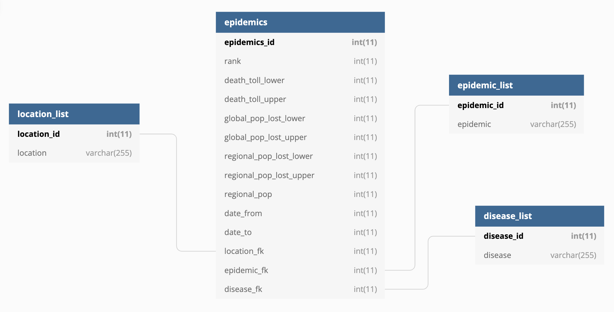

```{r setup, include=FALSE}
# Init
knitr::opts_chunk$set(echo = TRUE)
options(dplyr.summarise.inform = FALSE)
library(tidyverse)
library(knitr)
library(RCurl)
library(DiagrammeR)
library(kableExtra)
library(XML)
library(rvest)
```

## Project 2 {.tabset}

### Overview\
\
Discussion posts chosen for this project:\
\
1. My own: literary agents from pw.org\
2. Brad: New York voter registration from elections.ny.gov\
3. Daniel: epidemics listing from wikipedia.org\
\
In each of these cases, the following steps are performed:\
***Figure 1.** Overview flowchart*
\
```{r overview, echo=FALSE, fig.align="center"}

#Flowchart
grViz("digraph flowchart {
      # node definitions with substituted label text
      node [fontname = Helvetica, shape = rectangle]        
      tab1 [label = '@@1']
      tab2 [label = '@@2']
      tab3 [label = '@@3']
      tab4 [label = '@@4']
      tab5 [label = '@@5']
      tab6 [label = '@@6']

      # edge definitions with the node IDs
      tab1 -> tab2 -> tab3 -> tab4 -> tab5 -> tab6;
      }

      [1]: '1. Scrape from website'
      [2]: '2. Import CSV'
      [3]: '3. Tidy'
      [5]: '4. Normalize'
      [7]: '5. Data analysis'
      [8]: '6. Conclusion'
      
      labelloc = 't'
      label = 'test'
  ")
```

### Literary agents\
\
The task is to scrape the pw.org website for a listing of literary agents and store the results in a searchable format.\
\
* Scrape, parse, and store the agent listings.\
* Filter out the agents who are most likely to accept my book.\
* Display a list of candidate agents, along with submission guidelines.\

#### Scrape website\
\
I used a python script (data607-1.py) to scrape the dat from the pw.org website. The script does the following:\
\
1. Connects to pw.org and saves the html output to a file.\
2. Parses the file using a series of regular expressions.\
3. Saves the main agent listing in a csv file.\
4. Using the URLs scraped in step 2 above, connects to each agency's web page on pw.org.\
5. Scrapes the agency's web page and saves the html output to a file.\
6. Parses the files using regular expressions.\
7. Saves the agency info in a csv file.\
\

#### Import from Github\
\
```{r import1}

# Import the main pw.org listing CSV from Github
csvfile <- getURL("https://raw.githubusercontent.com/mmippolito/cuny/main/data607/project2/data607-main.csv")
pwmain <- read.csv(text = csvfile)
kable(pwmain[0:5,] %>% 
  mutate(genres = str_c(substr(genres, 0, 30), "..."), authors = str_c(substr(authors, 0, 30), "...")), caption = 
  "<i><font color=#000000><b>Table 1.</b> pw.org agent listing (main table) read from CSV</font></i>") %>% 
  kable_styling(latex_options = "striped")

# Import the agency listing CSV from Github
csvfile <- getURL("https://raw.githubusercontent.com/mmippolito/cuny/main/data607/project2/data607-agency.csv")
pwagencies <- read.csv(text = csvfile)
kable(pwagencies[0:5,] %>% 
  mutate(guidelines = str_c(substr(guidelines, 0, 30), "..."), tips = str_c(substr(tips, 0, 30), "...")), caption = 
  "<i><font color=#000000><b>Table 2.</b> pw.org agent listing (agents table) read from CSV</font></i>") %>% 
  kable_styling(latex_options = "striped")

```

#### Tidy\
\
Tidying tasks:\
\
* Separate genres by the pipe symbol and put into a separate dataframe.\
* Separate authors by the pipe symbol and put into a separate dataframe.\
\
``` {r tidy1}

# separate genres
agent_genres_df <- pwmain %>% select(agent_id, genres) %>% rename(agent_fk = agent_id)
agent_genres_df <- separate_rows(agent_genres_df, genres, sep = "\\|", convert = TRUE)
agent_genres_df <- mutate(agent_genres_df, agent_genre_id = row_number()) %>% 
  relocate(agent_genre_id, .before = agent_fk)

# separate clients (authors)
agent_authors_df <- pwmain %>% select(agent_id, authors) %>% rename(agent_fk = agent_id)
agent_authors_df <- separate_rows(agent_authors_df, authors, sep = "\\|", convert = TRUE)
agent_authors_df <- mutate(agent_authors_df, agent_author_id = row_number()) %>% 
  relocate(agent_author_id, .before = agent_fk)

```

#### Normalize\
\
Normalize the dataframes into third normal form. Entity relationship diagram:\
\
\
\
```{r normalize1}

# genres table
genres_df <- agent_genres_df %>% filter(genres != "") %>% group_by(genres) %>% summarize(genre = unique(genres)) %>%
  select(-genres) %>% mutate(genre_id = row_number()) %>% relocate(genre_id, .before = "genre")

# authors table
authors_df <- agent_authors_df %>% filter(str_length(authors) > 2) %>% group_by(authors) %>% summarize(author = unique(authors)) %>%
  select(-authors) %>% mutate(author_id = row_number()) %>% relocate(author_id, .before = "author")

# normalize agent_genres_df
agent_genres_df <- agent_genres_df %>% merge(genres_df, by.x = "genres", by.y = "genre") %>%
  select(-genres) %>% rename(genre_fk = genre_id)

# nNrmalize agent_authors_df
agent_authors_df <- agent_authors_df %>% merge(authors_df, by.x = "authors", by.y = "author") %>%
  select(-authors) %>% rename(author_fk = author_id)

# Remove genres and authors from pwmain since we normalized these fields
pwmain <- select(pwmain, -genres, -authors)

# Add primary key to pwagencies
pwagencies <- pwagencies %>% mutate(pwagency_id = row_number()) %>% relocate(pwagency_id, .before = agent_fk)

# Display tables
kable(genres_df[0:5,], 
  caption = "<i><font color=#000000><b>Table 3.</b> genres_df child tablef</font></i>") %>% 
  kable_styling(latex_options = "striped")
kable(authors_df[0:5,], 
  caption = "<i><font color=#000000><b>Table 4.</b> authors_df child tablef</font></i>") %>% 
  kable_styling(latex_options = "striped")
kable(agent_genres_df[0:5,], 
  caption = "<i><font color=#000000><b>Table 5.</b> agent_genres_df child tablef</font></i>") %>% 
  kable_styling(latex_options = "striped")
kable(agent_authors_df[0:5,], 
  caption = "<i><font color=#000000><b>Table 5.</b> agent_authors_df child tablef</font></i>") %>% 
  kable_styling(latex_options = "striped")

```

#### Analysis\
\
```{r analysis1a}

# Generate agent listing by select genres
selected_agents <- filter(genres_df, genre == "Speculative Fiction" | genre == "Literary Fiction") %>%
  merge(agent_genres_df, by.x = "genre_id", by.y = "genre_fk") %>%
  merge(pwmain, by.x = "agent_fk", by.y = "agent_id") %>%
  merge(pwagencies, by = "agent_fk") %>%
  spread(key = genre, value = genre) %>%
  mutate(`Literary Fiction` = ifelse(is.na(`Literary Fiction`), "no", "yes")) %>%
  mutate(`Speculative Fiction` = ifelse(is.na(`Speculative Fiction`), "no", "yes")) %>%
  select(-genre_id, -agent_genre_id, -link, -pwagency_id)

# Search agent tips for keywords
selected_agents <- selected_agents %>% 
  filter(str_detect(tips, regex("new|expand|suspense|characterization|voice", ignore_case = TRUE))) %>%
  select(agent_fk) %>% mutate(focus = "yes") %>%
  merge(selected_agents, by = "agent_fk", all.y = TRUE)
selected_agents <- arrange(selected_agents, focus, name)
kable(selected_agents[0:5,] %>% 
  mutate(guidelines = str_c(substr(guidelines, 1, 30), "..."), tips = str_c(substr(tips, 1, 30), "...")), 
  caption = "<i><font color=#000000><b>Table 6.</b> Selected agents listing</font></i>") %>% 
  kable_styling(latex_options = "striped")

```

```{r analysis1b}

# Which genres attract the most agents
agent_genres_df %>% group_by(genre_fk) %>% summarize(n = n()) %>%
  merge(genres_df, by.x = 'genre_fk', by.y = 'genre_id') %>%
  ggplot((aes(x = reorder(genre, n), y = n))) +
  geom_bar(stat = 'identity', fill = 'lightblue') + coord_flip() +
  xlab('genre') + ylab('count') +
  ggtitle('Figure 1. Literary agents by genre')

```

#### Conclusion\
\
While this wasn't a dataset I'd intended to perform an analysis on, it did allow for some tidying, and it creates a repeatable process that can be used periodically when the pw.org database changes.\
\
In terms of deliverables, the above process generates a concise listing of agents prioritized by those most likely to accept queries based on how similar they match my criteria.\
\
It was also interesting to note that there is a breadth of agents representing works of literary fiction, while a scant few who deal with speculative fiction. This tells me my chances of success could be limited and that it might be time to start writing pure literary fiction rather than speculating in speculative fiction.\
\

### New York Voters\
\
The task is to retrieve New York state voter registration data from https://www.elections.ny.gov/FoilRequestVoterRegDataPrint.html, tidy the data, and analyze the data over time. I limited my analysis to the past four datasets, since those were the ones provided in Excel format. The rest were in PDF, which would require considerable effort to export to CSV.\
\
I downloaded the Excel versions of the four files, exported them to CSV, then did some preliminary tidying using a text editor (e.g. removing blank lines and removing the title sections). These were the datasets I used:\
\
* Nov 2019\
* Feb 2020\
* Nov 2020\
* Feb 2021\
\

#### Import from Github\
\
```{r import2}

# Import the CSVs from Github
csvfile <- getURL("https://raw.githubusercontent.com/mmippolito/cuny/main/data607/project2/county_nov19.csv")
df_nov19 <- read.csv(text = csvfile)
csvfile <- getURL("https://raw.githubusercontent.com/mmippolito/cuny/main/data607/project2/county_feb20.csv")
df_feb20 <- read.csv(text = csvfile)
csvfile <- getURL("https://raw.githubusercontent.com/mmippolito/cuny/main/data607/project2/county_nov20.csv")
df_nov20 <- read.csv(text = csvfile)
csvfile <- getURL("https://raw.githubusercontent.com/mmippolito/cuny/main/data607/project2/county_feb21.csv")
df_feb21 <- read.csv(text = csvfile)

# Display sample data
kable(df_nov19[0:5,], caption = 
  "<i><font color=#000000><b>Table 7.</b> Sample raw data read from CSV</font></i>") %>% 
  kable_styling(latex_options = "striped")

```

#### Tidy\
\
Tidy data by gathering keyed off party.\
\
``` {r tidy2}

# Gather by party, add month and year fields
df_nov19 <- df_nov19 %>% gather(key = "party", value = "voters", 
  'CON', 'DEM', 'REP', 'WOR', 'GRE', 'LBT', 'IND', 'SAM', 'OTH', 'BLANK', 'TOTAL') %>%
  mutate(year = 2019, month = 11)
df_feb20 <- df_feb20 %>% gather(key = "party", value = "voters", 
  'CON', 'DEM', 'REP', 'WOR', 'GRE', 'LBT', 'IND', 'SAM', 'OTH', 'BLANK', 'TOTAL') %>%
  mutate(year = 2020, month = 2)
df_nov20 <- df_nov20 %>% gather(key = "party", value = "voters", 
  'CON', 'DEM', 'REP', 'WOR', 'GRE', 'LBT', 'IND', 'SAM', 'OTH', 'BLANK', 'TOTAL') %>%
  mutate(year = 2020, month = 11)
df_feb21 <- df_feb21 %>% gather(key = "party", value = "voters", 
  'CON', 'DEM', 'REP', 'WOR', 'OTH', 'BLANK', 'TOTAL') %>%
  mutate(year = 2021, month = 2)

# Cram all tables together into one dataframe, remove 'total' rows
nydf <- df_nov19 %>% union(df_feb20) %>% union(df_nov20) %>% union(df_feb21) %>%
  subset(STATUS != 'Total' & party != 'TOTAL' & REGION != 'Within NYC Total' & 
    REGION != 'Statewide Total' & REGION != 'Outside NYC Grand Tot' & REGION != 'Outside NYC Grand Total')

# Remove commas from numbers, convert to numeric, display table
nydf <- nydf %>% mutate(voters = gsub(',', '', nydf$voters)) %>% mutate(voters = as.numeric(voters))
kable(nydf[0:5,], caption = 
  "<i><font color=#000000><b>Table 8.</b> Tidied dataframe</font></i>") %>% 
  kable_styling(latex_options = "striped")
```

#### Normalize\
\
Normalize the dataframes into third normal form. Entity relationship diagram:\
\
\
\
```{r normalize2}

# Parties
parties <- data.frame(party_id = c(1:10), short_party = c('CON', 'DEM', 'REP', 'WOR', 'GRE', 'LBT', 'IND', 'SAM', 'OTH', 'BLANK'),
  party_name = c('Constitutaion', 'Democratic', 'Republican', 'Working Families', 'Green', 'Libertarian', 'Independent', 
  'Serve America Movement', 'Other', 'Blank'))

# Counties
counties <- nydf %>% group_by(COUNTY) %>% summarize(n = n()) %>% 
  mutate(county_id = row_number()) %>% select(-n) %>% relocate(county_id, .before = COUNTY) %>%
  rename(county = COUNTY)

# Regions
regions <- nydf %>% group_by(REGION) %>% summarize(n = n()) %>% 
  mutate(region_id = row_number()) %>% select(-n) %>% relocate(region_id, .before = REGION) %>%
  rename(region = REGION)

# Status
statuses <- data.frame(status_id = c(0, 1), status = c("Inactive", "Active"))

# Normalize main df
nydf <- nydf %>% merge(parties, by.x = 'party', by.y = 'short_party') %>%
  select(-party_name, -party) %>% rename(party_fk = party_id) %>%
  merge(counties, by.x = 'COUNTY', by.y = 'county') %>%
  select(-COUNTY) %>% rename(county_fk = county_id) %>%
  merge(regions, by.x = 'REGION', by.y = 'region') %>%
  select(-REGION) %>% rename(region_fk = region_id) %>%
  merge(statuses, by.x = 'STATUS', by.y = 'status') %>%
  select(-STATUS) %>% rename(status_fk = status_id) %>%
  arrange(year, month, region_fk, county_fk, party_fk, status_fk) %>%
  mutate(nydf_id = row_number()) %>% relocate(nydf_id, .before = voters)

# Display table
kable(nydf[0:10,], 
  caption = "<i><font color=#000000><b>Table 9.</b> Normalized data frame</font></i>") %>% 
  kable_styling(latex_options = "striped")

```

#### Analysis\
\
```{r analysis2a}

# Graph party registration over time
nydf %>% mutate(period = str_c(year, ' ', ifelse(month == 2, 'Feb', 'Nov'))) %>%
  filter(status_fk == 1) %>%
  group_by(party_fk, period) %>% summarize(voters = sum(voters)) %>%
  merge(parties, by.x = 'party_fk', by.y = 'party_id') %>%
  ggplot() + geom_bar(aes(x = short_party, y = voters, fill = period), stat = 'identity', position = 'dodge') +
  ggtitle("Figure 2. Party registration over time (active registrations only)") + theme_light()

```

```{r analysis2b}

# Party registration percent change between Nov 2019 and Feb 2021
nydf %>% mutate(period = str_c(year, ' ', ifelse(month == 2, 'Feb', 'Nov'))) %>%
  filter(status_fk == 1) %>%
  group_by(party_fk, period) %>% summarize(voters = sum(voters)) %>%
  filter(period == '2019 Nov' | period == '2021 Feb') %>%
  merge(parties, by.x = 'party_fk', by.y = 'party_id') %>%
  filter(short_party != 'OTH') %>%
  spread(key = period, value = voters) %>%
  mutate(`2021 Feb` = ifelse(is.na(`2021 Feb`), 0, `2021 Feb`)) %>%
  mutate(pct_change = 100 * (`2021 Feb` - `2019 Nov`) / `2019 Nov`) %>%
  filter(`2021 Feb` != 0) %>%
  ggplot(aes(x = reorder(short_party, -pct_change), y = pct_change)) + 
  geom_bar(stat = 'identity', fill = 'lightblue') +
  ggtitle("Figure 3. Party registration percent change between Nov 2019 and Feb 2021<br>\n(exluding 'other' party and parties not present in Feb 2021)") + xlab("Party") + theme_light() + geom_text(aes(label = round(pct_change, 1)), vjust = 1.5)
  

```

```{r analysis2c}

# Voter percent change by count between Nov 2019 and Feb 2021
tmpdf <- nydf %>% mutate(period = str_c(year, ' ', ifelse(month == 2, 'Feb', 'Nov'))) %>%
  filter(status_fk == 1) %>%
  group_by(county_fk, period) %>% summarize(voters = sum(voters)) %>%
  filter(period == '2019 Nov' | period == '2021 Feb') %>%
  merge(counties, by.x = 'county_fk', by.y = 'county_id') %>%
  spread(key = period, value = voters) %>%
  mutate(pct_change = 100 * (`2021 Feb` - `2019 Nov`) / `2019 Nov`) %>%
  arrange(desc(pct_change))

# top 20
tmpdf %>% head(20) %>%
  ggplot(aes(x = reorder(county, pct_change), y = pct_change)) + geom_bar(stat = 'identity', fill = 'lightblue') +
  ggtitle("Figure 3. The 20 counties seeing the most growth in registrations<br>\nbetween Nov 2019 and Feb 2021") +
  coord_flip() + xlab("County") + theme_light() + geom_text(aes(label = round(pct_change, 1)), hjust = 1.2)

# bottom 20
tmpdf %>% tail(20) %>%
  ggplot(aes(x = reorder(county, pct_change), y = pct_change)) + geom_bar(stat = 'identity', fill = 'lightblue') +
  ggtitle("Figure 4. The 20 counties seeing the least growth in registrations<br>\nbetween Nov 2019 and Feb 2021") +
  coord_flip() + xlab("County") + theme_light() + geom_text(aes(label = round(pct_change, 1)), hjust = 1.2)

```

#### Conclusions\
\
Based on the above, the following conclusions can be drawn:\
\
* Between Nov 2019 and Feb 2021, the biggest increase was seen in unaffilated voters (assumed by blank registration).\
* Orange County saw the biggest increase at 8.8%.\
* Livingston County was the only county to see a decline in registrations (-0.3%).\
\

### Epidemics\
\
The task is to retrieve world and regional epidemic data from https://en.wikipedia.org/wiki/List_of_epidemics and tidy the data. Analysis includes evaluating:\
\
* which diseases cause the most pandemics\
* which diseases have been the most disastrous to humans\
* regions of the world most prone to outbreaks\
\

#### Scrape the data from wikipedia\
\
```{r scrape3}

# Scrape the data from wikipedia
parsed_page <- read_html("https://en.wikipedia.org/wiki/List_of_epidemics", encoding = "UTF-8")

# Parse out the tables
parsed_tables <- html_table(parsed_page, fill = TRUE)
epidemics <- data.frame(parsed_tables[1])
chron <- data.frame(parsed_tables[2])

# Display sample data
kable(epidemics[0:5,], caption = 
  "<i><font color=#000000><b>Table 10.</b> Sample epidemic data</font></i>") %>% 
  kable_styling(latex_options = "striped")
kable(chron[0:5,], caption = 
  "<i><font color=#000000><b>Table 11.</b> Sample chronology data</font></i>") %>% 
  kable_styling(latex_options = "striped")

# Save to CSV
write.csv(epidemics, "epidemics.csv")
write.csv(chron, "chron.csv")

```

#### Tidy\
\
Tidy data:\
\
* Remove bracketed notes.\
* Split ranges into two fields (upper and lower).\
* Remove extraneous words.\
* Make numeric fields numeric.\
\
``` {r tidy3, warning = FALSE}

# Add disease column to epidemics table
epidemics <- mutate(epidemics, disease = c("bubonic plague", "influenza", "bubonic plague", "HIV", "bubonic plague", 
  "cocoliztli", "smallpox", "smallpox", "coronavirus", "typhus", "influenza", "influenza", "cocoliztli", 
  "smallpox", "bubonic plague", "bubonic plague", "cholera", "bubonic plague", "influenza"))

# Death toll: remove extraneous stuff, split to lower and upper ranges
epidemics <- epidemics %>% mutate(death_toll = gsub(' million', '', epidemics$`Death.toll`)) %>%
  separate(death_toll, sep = '–', into = c('death_toll_lower', 'death_toll_upper')) %>%
  mutate(death_toll_lower = gsub('^(\\d+)[^\\d]?.*', '\\1', death_toll_lower)) %>%
  mutate(death_toll_upper = ifelse(is.na(death_toll_upper), death_toll_lower, death_toll_upper)) %>%
  select(-`Death.toll`) %>% mutate(death_toll_lower = as.numeric(death_toll_lower)) %>%
  mutate(death_toll_upper = as.numeric(death_toll_upper))

# Global population lost
epidemics <- epidemics %>% mutate(global_pop_lost = gsub('\\[.*\\]', '', `Global.population.lost`)) %>%
  mutate(global_pop_lost = gsub('%', '', global_pop_lost)) %>%
  separate(global_pop_lost, sep = '–', into = c('global_pop_lost_lower', 'global_pop_lost_upper')) %>%
  mutate(global_pop_lost_lower = ifelse(global_pop_lost_lower == '', NA, global_pop_lost_lower)) %>%
  mutate(global_pop_lost_upper = ifelse(is.na(global_pop_lost_upper), global_pop_lost_lower, global_pop_lost_upper)) %>%
  select(-`Global.population.lost`) %>% mutate(global_pop_lost_lower = as.numeric(global_pop_lost_lower)) %>%
  mutate(global_pop_lost_upper = as.numeric(global_pop_lost_upper))
  
# Regional population lost
epidemics <- epidemics %>% mutate(regional_pop_lost = gsub('\\[.*\\]', '', `Regional.population.lost`)) %>%
  mutate(regional_pop_lost = gsub('^–$', '', regional_pop_lost)) %>% 
  separate(regional_pop_lost, sep = " of ", into = c('regional_pop_lost', 'regional_pop')) %>%
  mutate(regional_pop_lost = gsub('%', '', regional_pop_lost)) %>% 
  separate(regional_pop_lost, sep = '–', into = c('regional_pop_lost_lower', 'regional_pop_lost_upper')) %>%
  mutate(regional_pop_lost_lower = ifelse(regional_pop_lost_lower == '', NA, regional_pop_lost_lower)) %>%
  mutate(regional_pop_lost_upper = ifelse(is.na(regional_pop_lost_upper), regional_pop_lost_lower, regional_pop_lost_upper)) %>%
  select(-`Regional.population.lost`) %>% mutate(regional_pop_lost_lower = as.numeric(regional_pop_lost_lower)) %>%
  mutate(regional_pop_lost_upper = as.numeric(regional_pop_lost_upper))

# Date
epidemics <- epidemics %>% mutate(dates = gsub('^(.+?) .+$', '\\1', `Date`)) %>%
  mutate(dates = gsub('present', format(Sys.Date(), "%Y"), dates)) %>%
  separate(dates, sep = '–', into = c('date_from', 'date_to')) %>%
  select (-`Date`) %>%
  mutate(date_from = as.numeric(date_from)) %>% mutate(date_to = as.numeric(date_to))

# Rename columns for consistency
epidemics <- epidemics %>% rename(epidemic = `Epidemics.pandemics`) %>%
  rename(rank = Rank)

```

#### Normalize\
\
Normalize the location field.\
\
\
\
```{r normalize3}

# Tidy the location field
epidemics <- epidemics %>% mutate(location = gsub(', and', ',', Location)) %>%
  mutate(location = gsub(' and ', ', ', location)) %>%
  separate_rows(location, sep = ', ', convert=TRUE) %>%
  select(-Location)

# Create location_list child table
location_list <- epidemics %>% group_by(location) %>% summarize(n = n()) %>%
  mutate(location_id = row_number()) %>% select(-n) %>%
  relocate(location_id, .before = location)

# Create epidemic_list child table
epidemic_list <- epidemics %>% group_by(epidemic) %>% summarize(n = n()) %>%
  mutate(epidemic_id = row_number()) %>% select(-n) %>%
  relocate(epidemic_id, .before = epidemic)

# Create diseases child table
disease_list <- epidemics %>% group_by(disease) %>% summarize(n = n()) %>%
  mutate(disease_id = row_number()) %>% select(-n) %>%
  relocate(disease_id, .before = disease)

# Normalize main df
epidemics <- epidemics %>% merge(location_list, by = 'location') %>%
  select(-location) %>% rename(location_fk = location_id) %>%
  merge(epidemic_list, by = 'epidemic') %>%
  select(-epidemic) %>% rename(epidemic_fk = epidemic_id) %>%
  merge(disease_list, by = 'disease') %>%
  select(-disease) %>% rename(disease_fk = disease_id) %>%
  arrange(date_from) %>%
  mutate(epidemics_id = row_number()) %>% relocate(epidemics_id, .before = rank)

# Display table
kable(epidemics[0:10,], 
  caption = "<i><font color=#000000><b>Table 12.</b> Normalized data frame</font></i>") %>% 
  kable_styling(latex_options = "striped")

```

#### Analysis\
\
```{r analysis3a}

# Graph count of epidemics by disease
epidemics %>% group_by(disease_fk) %>% summarize(n = n()) %>%
  merge(disease_list, by.x = 'disease_fk', by.y = 'disease_id') %>%
  ggplot(aes(x = reorder(disease, -n), y = n)) + geom_bar(stat = 'identity', fill = 'lightblue') +
  theme_light() + geom_text(aes(label = n), vjust = -0.3) + xlab('disease') +
  ggtitle("Figure 5. Epidemics by disease")

```

```{r analysis3b}

# Graph death toll by disease
epidemics %>% group_by(disease_fk) %>% summarize(toll_hi = sum(death_toll_upper)) %>%
  merge(disease_list, by.x = 'disease_fk', by.y = 'disease_id') %>%
  ggplot(aes(x = reorder(disease, -toll_hi), y = toll_hi)) + geom_bar(stat = 'identity', fill = 'lightblue') +
  theme_light() + geom_text(aes(label = toll_hi), vjust = -0.3) + xlab('disease') +
  ggtitle("Figure 6. Deadliest epidemics by disease (by upper limit of death toll)") +
  ylab("Death toll in millions")

```

```{r analysis3c}

# Graph epidemics by region
epidemics %>% group_by(location_fk) %>% summarize(n = n()) %>%
  merge(location_list, by.x = 'location_fk', by.y = 'location_id') %>%
  ggplot(aes(x = reorder(location, n), y = n)) + geom_bar(stat = 'identity', fill = 'lightblue') +
  theme_light() + geom_text(aes(label = n), hjust = -1.2) + xlab('region') +
  ggtitle("Figure 7. Epidemics by region") + coord_flip() + ylab("# of epidemics")

```

#### Conclusions\
\
Based on the above, the following conclusions can be drawn:\
\
* Bubonic plague has been by far the most prevalent source of epidemic throughtout history.\
* Likewise, bubonic plague has been the most deadly in terms of lives lost.\
* Of the areas survey, most epidemics have been worldwide phenomena. Mexico has seen the highest number of regional-specific epidemics.\
\
